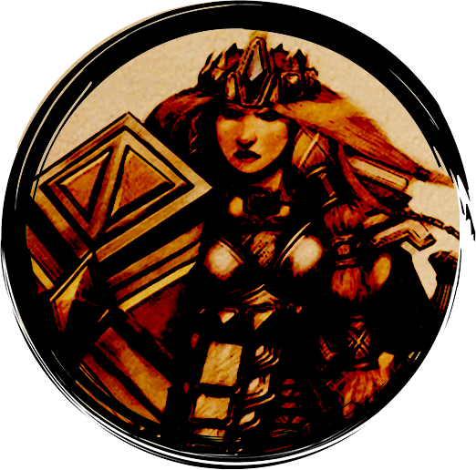
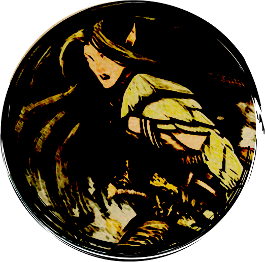
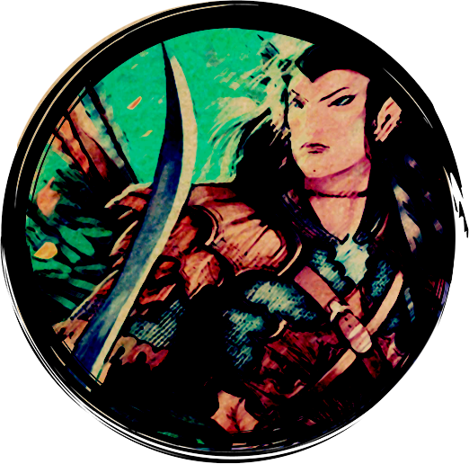
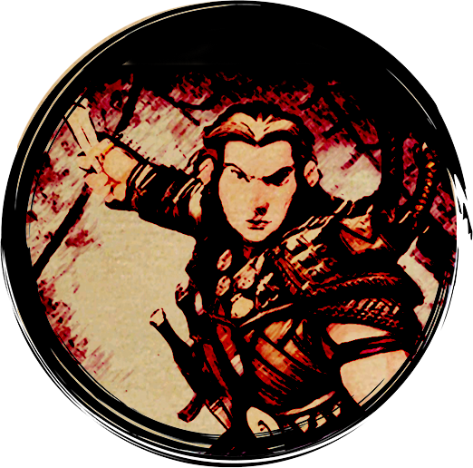

<a href="/early-access/"><< Volver</a>

  
  
  
  
  

* * *

# Dwall, guerrera enana

La pétrea Dwall mantiene a raya a los rivales y concede amparo a sus compañeros malheridos. Pero no la tomes a la ligera, su poderoso martillo del risco hará temblar (literalmente) a cualquier rival...

<dl>
<dt>Rol</dt>
<dd>Defensora</dd>
<dt>Complejidad</dt>
<dd>Baja</dd>
</dl>

## Clase

### Guerrero

> "¡Antes tendrás que enfrentarte conmigo, dragón!" 

Eres muy dura y tienes aptitudes excepcionales para contener a los enemigos en el cuerpo a cuerpo.

## Poderes

### A voluntad
<dl>
<dt>Estampida Amenazante</dt>
<dd>Dwall se arroja en medio de sus enemigos, atrayendo sus ataques contra ella</dd>
<dt>Marea de Hierro</dt>
<dd>Tras cada golpe, Dwall interpone su escudo y lo utiliza para empujar a su enemigo hacia atrás</dd>
</dl>

### De encuentro
<dl>
<dt>Campanazo</dt>
<dd>Dwall propina un poderoso martillazo contra su enemigo, aturdiendo sus sentidos</dd>
<dt>Desvío con Escudo</dt>
<dd>Dwall desvía un ataque con el filo de su escudo y aprovecha la apertura para propinar un poderoso contraataque</dd>
<dt>Entereza enana *(racial enana)*</dt>
<dd>Extraes fuerza de tu interior para recuperar tu vitalidad perdida.</dd>
</dl>

### Diarios
<dl>
<dt>Prensa de Acero</dt>
<dd>Dwall ataca a su enemigo y utiliza su escudo para inmovilizarlo en el sitio</dd>
<dt>Postura Defensiva</dt>
<dd>Dwall adquiere una postura cautelosa que le permite posicionarse ante los ataques de sus oponentes</dd>
</dl>

* * *
