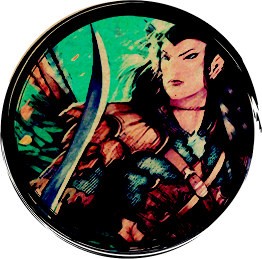
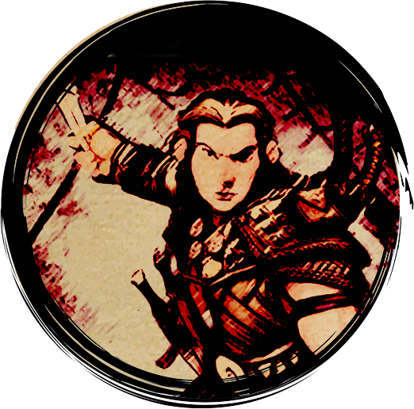

<a href="/early-access/"><< Volver</a>

  
  
  
  
  

* * *

# Elenwed, explorador elfo

Elenwed y sus dos espadas forman un torbellino imparable en el campo de batalla. Capaz de realizar ataques en área o golpear y defenderse a la vez, es un versátil combatiente, y muy efectivo si encuentra la oportunidad adecuada.

## Clase

### Explorador

> ""Yo me encargaré del que está en la retaguardia. Ese gran trasgo se arrepentirá de haber empuñado un arco". 

Te concentras bien en los ataques a distancia o en la lucha cuerpo a cuerpo con dos armas para infligir una gran cantidad de daño aun único enemigo cada vez. Tus ataques
confían en la velocidad y la movilidad, ya que prefieres emplear tácticas de guerrilla siempre que te sea posible. 

## Poderes

### A voluntad
<dl>
<dt>Impacto gemelo</dt>
<dd>Si el primer ataque no lo mata, el segundo podrá hacerlo. </dd>
<dt>Barrera de espadas</dt>
<dd>Elenwed se defiende con un arma mientras golpea con la otra</dd>
</dl>

<dl>
<dt>Rol</dt>
<dd>Pegador</dd>
<dt>Complejidad</dt>
<dd>Media</dd>
</dl>

### De encuentro
<dl>
<dt>Impacto del carcayú</dt>
<dd>Hieres a todos los enemigos que te rodean con la ferocidad  de un carcayú herido.</dd>
<dt>Golpe sostenible</dt>
<dd>Realizas dos golpes con tu arma. Si el primero acaba con tu enemigo, conserva la suficiente energía como para utilizarlo de nuevo en el futuro.</dd>
<dt>Precisión élfica *(racial élfica)*</dt>
<dd>Con un instante de concentración, apuntas cuidadosamente a tu enemigo y disparas con la legendaria precisión de los elfos.</dd>
</dl>

### Diarios
<dl>
<dt>Corte segador</dt>
<dd>Realizas un amplio arco con ambas armas, derribando a dos enemigos. Una vez en el suelo, los atraviesas con las espadas.</dd>
</dl>

* * *
