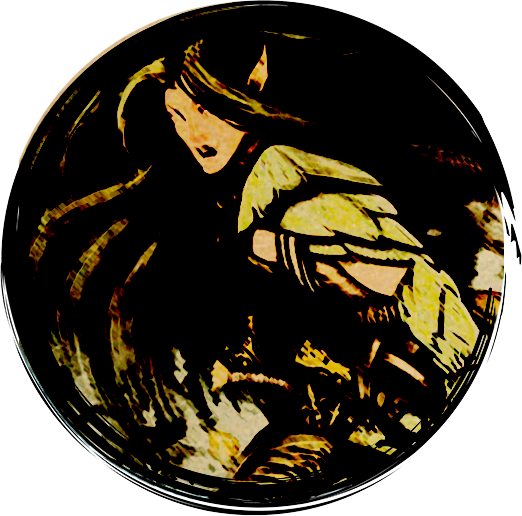

<a href="/early-access/"><< Volver</a>

  
  
  
  
  

* * *

# No'Tashe, exploradora elfa

No’Tashe se mueve veloz como el viento en el campo de batalla, hostigando y relentizando a sus enemigos con su incesante lluvia de flechas. Cuando se fija una presa, su precisión élfica se vuelve letal.

<dl>
<dt>Rol</dt>
<dd>Pegadora</dd>
<dt>Complejidad</dt>
<dd>Media</dd>
</dl>

## Clase

### Explorador

> ""Yo me encargaré del que está en la retaguardia. Ese gran trasgo se arrepentirá de haber empuñado un arco". 

Te desenvuelves bien con los ataques a distancia o con la lucha cuerpo a cuerpo con dos armas para infligir una gran cantidad de daño a un único enemigo cada vez. Tus ataques confían en la velocidad y la movilidad, ya que prefieres emplear tácticas de guerrilla siempre que te sea posible. 

## Poderes

### A voluntad
<dl>
<dt>Impacto Ágil</dt>
<dd>Te escurres atravesando la guardia de tu enemigo para hacer tu ataque, o realizas un ataque y tras él te retiras a una posición más ventajosa</dd>
<dt>Impacto Gemelo</dt>
<dd>Realizas un golpe doble. Si el primer ataque no lo mata, el segundo podrá hacerlo</dd>
</dl>

### De encuentro
<dl>
<dt>Impacto del Colmillo Doble</dt>
<dd>Hundes dos flechas en la carne de tu enemigo, haciéndole aullar de dolor</dd>
<dt>Impacto del Jabalí de Colmillo de Trueno</dt>
<dd>Atacas dos veces con tanta potencia que haces que tus enemigos se tambaleen hacia atrás</dd>
<dt>Precisión Élfica</dt>
<dd>Con un instante de concentración, apuntas cuidadosamente a tu enemigo y disparas con la legendaria precisión de los elfos</dd>
</dl>

### Diarios
<dl>
<dt>Disparo Certero</dt>
<dd>No'Tashe apunta meticulosamente para realizar un disparo que golpee a su enemigo en sus puntos vitales</dd>
<dt>Que Comience la Caza</dt>
<dd>No'Tashe marca a un objetivo al principio del combate, inflingiéndole daño adicional durante toda la batalla</dd>
</dl>

* * *
