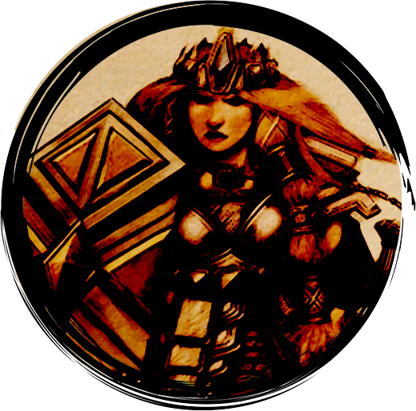

<a href="/early-access/"><< Volver</a>

  
  
  
  
  

* * *

# Presto, mago humano

Presto tiene más que un as bajo la manga... ¡Tiene un libro de hechizos completo! Presto dispone de multitud de herramientas para controlar el flujo de la batalla. ¡Pero deberá elegir bien, antes del combate, qué hechizos prepara y tendrá disponibles!

<dl>
<dt>Rol</dt>
<dd>Controlador</dd>
<dt>Complejidad</dt>
<dd>Alta</dd>
</dl>

## Clase

### Mago

> "Yo soy el fuego que arde, la niebla que asfixia, la  tormenta que  descarga  la devastación  sobre  nuestros  enemigos" 

Ejerces el control mediante efectos mágicos que cubren grandes zonas, a veces entorpeciendo a tus 
enemigos y a veces consumiéndolos  con llamas. 

## Poderes

### A voluntad
<dl>
<dt>Proyectil mágico</dt>
<dd>Lanzas un rayo de fuerza plateado a un enemigo. </dd>
<dt>Onda atronadora</dt>
<dd>Creas un restallido de poder sónico que golpea desde el suelo.</dd>
<dt>Nube de dagas</dt>
<dd>Creas una pequeña nube de dagas de fuerza arremolinadas que atacan implacablemente a las criaturas en el área.</dd>
</dl>

### De encuentro
<dl>
<dt>Impacto helador </dt>
<dd>Creas un rayo de gélida energía púrpura en torno a tu mano y lo arrojas hacia tu enemigo.</dd>
<dt>Manos ardientes</dt>
<dd>Una feroz explosión de llamas brota de tus manos y abrasa a los enemigos cercanos.</dd>
</dl>

*(Puedes decidir utilizar Vortice inmovilizante en lugar de cualquiera de sus otros poderes de Encuentro)*

<dl>
<dt>Vortice inmovilizante</dt>
<dd>Invoca un tornado en miniatura que alza a su enemigo, inmovilizandole y dejandole expuesto a tus ataques y los de tus compañeros.</dd>
</dl>

### Diarios
*(Al comienzo del combate, elige una de estas 3)*

<dl>
<dt>Grasa</dt>
<dd>Cubres el suelo de aceite resbaladizo que hace trastabillar y caer a tus enemigos.</dd>
<dt>Dormir</dt>
<dd>Impones tu voluntad sobre tus enemigos, tratando de abrumarlos con una oleada de agotamiento mágico.</dd>
<dt>Flecha ácida</dt>
<dd>Una resplandeciente flecha hecha de un líquido verde brillante se precipita como un rayo hacia tu objetivo y estalla salpicando gotas de ácido corrosivo a su alrededor.</dd>
</dl>

*(Al comienzo del combate, elige una de estas 2)*

<dl>
<dt>Espadas guardianas</dt>
<dd>Tres espadas espectrales aparecen a tu alrededor, manteniendo a raya a tus enemigos.</dd>
<dt>Retirada expeditiva</dt>
<dd>Tu imagen se difumina mientras te mueve velozmente por el campo de batalla.</dd>
</dl>

* * *
